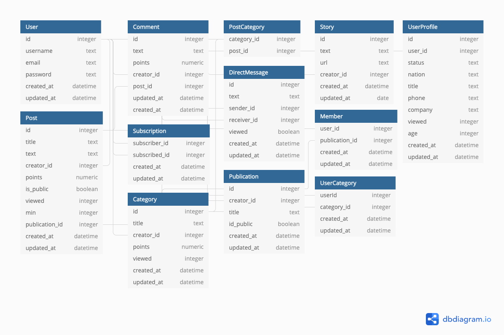

# SQL practice for social network (blog reddit clone) database design

This is my practice SQL for design reddit-clone app database. I use PostgreSQL.

## Tables

I use `db.diagram.io` to plan and design tables, relations for the app.



## Create table

```SQL
create table users (
    id serial primary key,
    username varchar(255) not null,
    email varchar(255) not null,
    password varchar(255) not null
);
-- other tables
```

## Mock data generator tool

After create table entities, I use a tool for generating fake data for my
PostgreSQL database

https://postgres-fake-data.netlify.app/

It would randomly generates 100 rows for each table.

## Some questions

- Return user profile with a specific `user_id`
- Return post which has most viewed numbers
- Return post which has most comments
- Return direct messages from 2 specific users
- Return story from a specific user
- Return user who has created most stories
- ...(please check in the file .sql)
